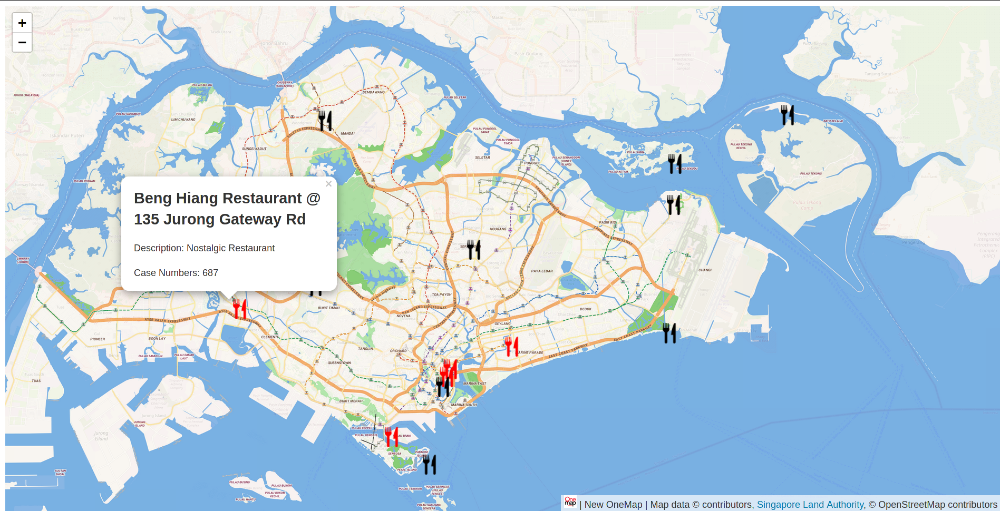

# Restaurant Mapper microservice



## About

This is a project built for G2T4, CS203 project.

It is a microservice built using [express.js](https://expressjs.com/) and uses the [OneMap API](https://www.onemap.gov.sg/docs/).

## Installation

```bash
npm install
npm start

# If you are in windows
npm start-windows
```

## Getting Started

The main website can be accessed at the root of the website.

### API Documentation

The following endpoints are available and exposed for users to retrieve the restaurants in a specific object. This object can be parsed by the LeafletJS plugin to pin out restaurants on the Singapore map.

The prefix for all the API URI is `/api/v1`.

| Method | Endpoint     | Body               | Description                                                    |
| ------ | ------------ | ------------------ | -------------------------------------------------------------- |
| GET    | /restaurants | NIL                | Retrieve all the restaurant data as a FeatureCollection object |
| POST   | /restaurants | Restaurant in JSON | The Java backend will send a restaurant DTO in JSON            |

## Production

To run it in production mode, run the command `npm run prod`. Else, you may follow the instructions to spin up a docker instance.

```bash
docker build .
```
